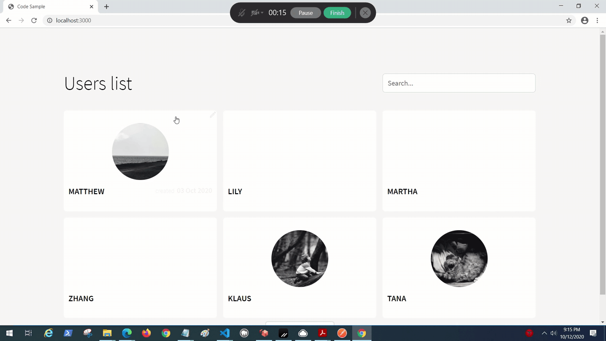

# Nextjs and Vanilla React

This project was created as source material for an informative podcast. The images are pulled randomly from [Unsplash](unsplash.com).

There are two client projects with the same features. All front-end clients use the backend found in `server` backend.

## Preview

Once you get the client and server running. You should see something like this...



## Installation

In each project folder, you must run `npm install`. For the clients, their project folders are `projects/client/next-client` and `projects/client/vanilla-client`. The server's project folder is `projects/server`.

## Usage

The server can be started using `npm start` in the server project directory. The server will create a sqlite database.

The client does not provide a way to write to the database; you must do so manually.

Use postman or some other http client to populate the database. The following POST message will work. Change the host to wherever the backend is running.

```
POST http://localhost:4040/users
Content-Type: application/json

{
    "name": "John"
}
```

Additionally, you can add tags to users using below.

```
POST http://localhost:4040/users/<user_id>/tags
Content-Type: application/json

{
    "description": "Developer"
}
```

Choose which client you want to run, navigate to that project folder, then run `npm start`. This will launch the development version of that client.

## Notes - Client

The client uses redux to manage much of the state.

The root redux state is in `src/root-state.types.ts`.

For each slice, the slice is in a `redux` folder.

It is organized

```
redux\
    [slice-name].types.ts
    [slice-name].actions.ts
    [slice-name].slice.ts
```

The root state imports `[slice-name].types.ts`.

The order of imports below

```
root-state.types.ts < [slice-name].types.ts
[slice-name].slice.ts < [slice-name].actions.ts < [slice-name].types.ts
[slice-name].slice.ts < [slice-name].types.ts
```
